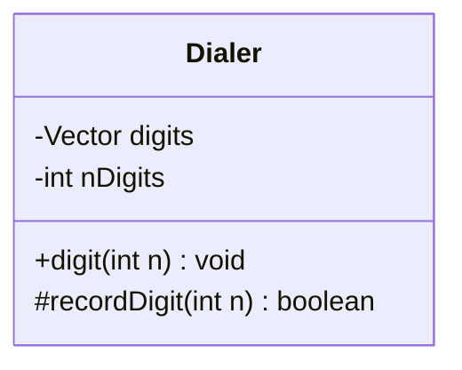
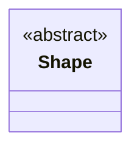
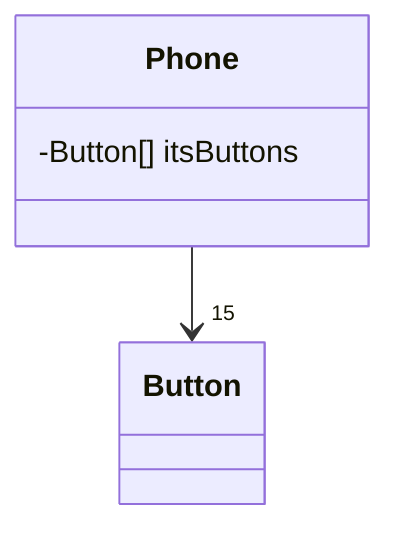
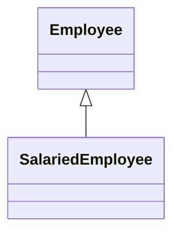
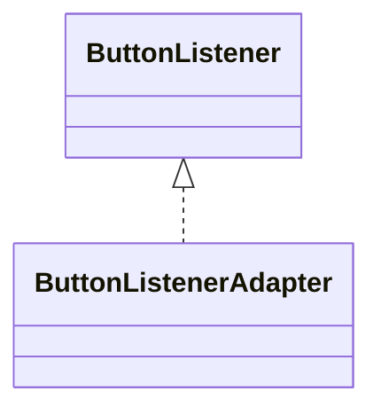
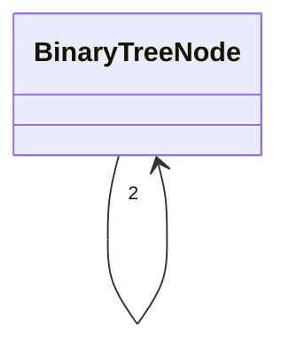

## ClassDiagram
- 클래스 내부의 정적인 내용이나 클래스 간의 의존 관계를 표기

### 클래스 표기
```java 
public class Dialer{
	private Vector digits;
	int nDigits;
	public void digit(int n);
	protected boolean recordDigit(int n);
}
```

- 첫번째 구획은 클래스명, 둘째 구획에는 클래스 변수, 세번째 구획에는 메서드를 표기한다.
- 접근 제어자
	- `-` : private
	- `#` : protected
	- `+` : public
- 불필요한 세부사항은 다이어그램의 복잡도를 증가시키므로 다이어그램을 그리는 목적에 꼭 필요한 것만 사용해야 한다.

### 추상클래스, 추상메서드
- 이름을 이탤릭체로 적거나 {abstract} 프로퍼티를 사용


### 연관 관계 표기
- 클래스 사이의 연관은 다른 객체의 참조를 가지는 인스턴스 변수를 의미
```java 
public class Phone{
	private Button[15] itsButtons;
}
```

- 화살표 방향에 따라 Phone이 Button의 참조를 가짐을 알 수 있다. 
- 화살촉의 숫자는 인스턴스 변수가 참조를 몇 개나 가질지 알려준다.

### 상속 관계 표기
- 화살촉의 모양에 따라서 관계가 구분되므로 주의! (상속 관계를 세로 방향, 연관 관계는 가로 방향으로 그리는것도 팁)
```java 
public class Employee{
	
}

public class SalariedEmployee extends Employee{
	
}
```

```java 
public interface ButtonListener{
	
}

public class ButtonListenerAdapter implements ButtonListener{
	
}
```

- 클래스 간의 상속구조는 화살표에 실선으로 표기, 인터페이스 구현구조는 점선으로 표기

### 집합 관계 표기
- 연관 관계를 더 구체적으로 표현
- 전체 객체와 부분 객체의 연관을 나타낸다. 전체 객체와 부분 객체의 라이프 타임은 독립적.
- 연관 관계와 명확한 차이가 없고, UML 2.0 스펙에서는 삭제됨.

### 합성 관계 표기
- 집합의 특별한 형태, 부분 객체의 라이프 타임이 전체 객체에 의존적 (즉, 전체 객체가 사라지면 부분 객체도 사라짐)
- 수명 관리가 필요없는 자바 프로그램에서는 그다지 유용하지 않음.

### 다수성
 ```java 
public class BinaryTreeNode{
	private BinaryTreeNode left;
	private BinaryTreeNode right;
}
```

- 인스턴스에 연결된 클래스의 인스턴스 수를 나타낸다.
- 형식
	- `숫자` : 인스턴수 수
	- `*`, `0..*` : 0개 또는 그 이상
	- `0..1` : 0개 또는 1개 (Java에서는 nullable 참조로 구현)
	- `1..*` : 1개 또는 그 이상


#### Reference
- UML 실전에서는 이것만쓴다. 로버트 마틴
- https://mermaid-js.github.io/mermaid/#/./classDiagram
